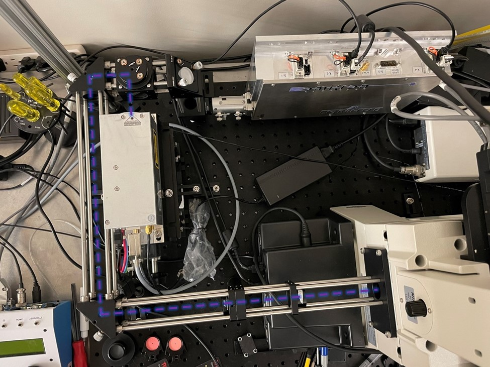
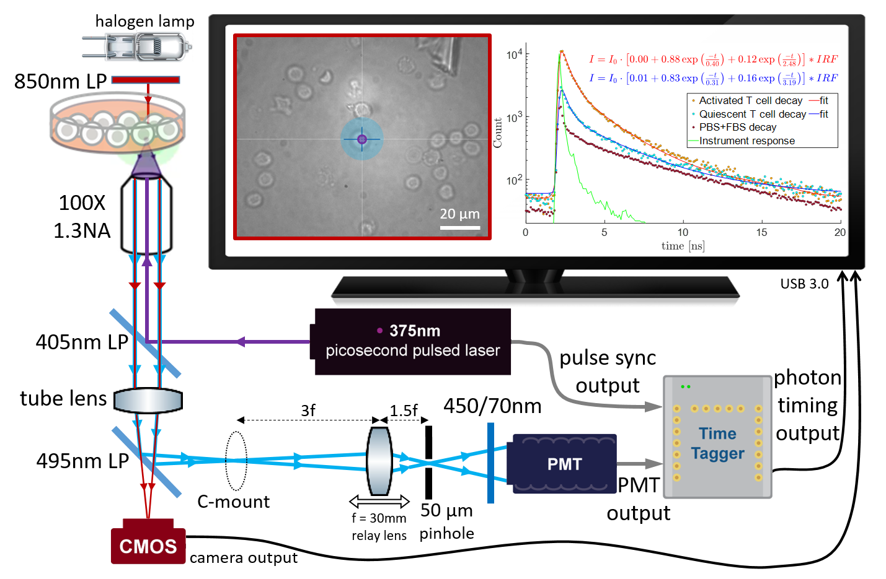

### Build guide

The excitation laser was collimated and contracted using a Keplerian telescope lens pair with a magnifying power of 3, and launched through a 30mm cage system with two right-angle kinematic mirror mounts (KCB1C) onto the center of the epi illumination port on the back of the inverted Eclipse Ti-S microscope. The 405nm LP dichroic beam splitter was installed in a filter cube and mounted in the filter cube turret of the microscope to reflect excitation UV beam up towards the sample and allow emitted fluorescence down through the microscope body and tube lens towards the eyepiece and side port. See pictures below.

Near-infrared bright-field illumination through the microscope’s condenser lens was achieved by installing an 850nm Schott glass long-pass filter in the halogen lamp house.

The sliding silvered mirror in the microscope eyepiece base that selectively directs light either to the eyepiece binocular or the side port was removed and replaced with the 495nm long-pass dichroic beam splitter. This allows for simultaneous near-IR bright-field imaging of the sample using a CMOS camera (Basler ace) on the eye piece while the NAD(P)H fluorescence can be detected on the side port.

The NAD(P)H fluorescence detection arm was built on a 30mm cage system secured to the C-mount  on the side port. The f=30 mm relay lens was installed in a translating lens mount (CXY1) at a distance of 3f from the C-mount image plane. The 50 μm pinhole was installed in the micrometer translation mount (ST1XY-D) at a distance of 1.5f after the relay lens. The emission filter (450/70 nm) was mounted in a 0.5” SM1 extension tube and the PMT was installed at the end of the extension tube. The fine adjustment in placement of the relay lens and the pinhole is performed before each experiment using appropriately-sized fluorescent YG beads and solutions of coumarin 6 such that the fluorescence count rate detected by the PMT is maximized. The PMT output as well as the laser sync pulse output are routed via shielded coaxial cables (50 ohm) to the first two input channels of the Time Tagger Ultra 8.

A custom Python script that calls the Time Tagger API’s functions (see Time Tagger’s user manual) aggregates fluorescence decay events over a user-defined integration period into a decay histogram. The decay histograms from individual cells are analyzed in post-processing using a custom Matlab script (link to GitHub) that fits them to a bi-exponential decay model and also calculates phasor coordinates.

The schematic diagram shows the system’s light path and major components as well as representative bright-field image and NADH(P)H fluorescence decays captured from activated and quiescent T cells.

A comparison between the proposed single-photon system based on Time to Digital Conversion (TDC) electronics and the industry-standard two-photon fluorescence lifetime imaging microscope (FLIM) based on Time to Amplitude Conversion (TAC) electronics is made in the table below, including cost, size, and performance of components. Please see references below for more details.

|  | 1P TDC system | 2P TAC system
|---|---------------|--------------
| Laser cost | $16k picosecond-pulsed   diode laser | $250k femtosecond-pulsed    Ti:sapphire laser [1] |
Laser size | 17.5 x 6.5 x 6 (cm) | 91 x 50 x 18.5 (cm) + external cooling and power supply
EOM cost | N/A | $5k Pockels cell
TCSPC electronics cost | ~ $20k Time Tagger Ultra 8 [2] | ~ $20k Becker&Hickl SPC-150 [3]
TCSPC dead time | 2 ns | 100 ns
Timing jitter | 22 ps RMS    (option for 4 ps) | 2.5 ps RMS
Photon count rate | 25 Mcps sustained   250 Mcps maximum burst | 5 Mcps sustained   10 Mcps maximum burst

**References**
* [1]	https://eliceirilab.org/sites/default/files/2016-07/90044047,%20Rev%20B,%20InSight%20User's%20Manual.pdf
* [2]	https://www.swabianinstruments.com/static/downloads/TimeTagger.pdf
* [3]	https://www.becker-hickl.com/products/spc-150n/#product-specs

Compared to 2P TAC FLIM systems, our simplified 1P TDC system combines significantly reduced cost (~20-fold) and footprint (~40-fold) due to employing a diode laser, with increased maximum count rate (5-fold) due to fast FPGA electronics with low dead time. This combination has the potential to make metabolic assays based on autofluorescence lifetime measurements more accessible to scientific and cell manufacturing communities.