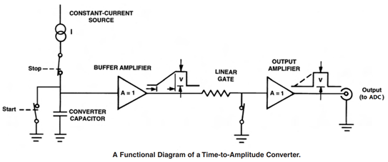
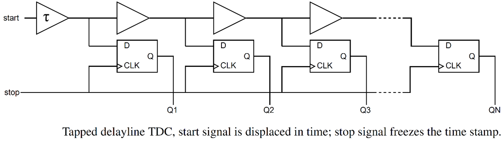

### Brief introduction to fluorescence lifetime detection techniques

Frequency-domain lifetime measurement is the simplest and fastest method of obtaining the mean lifetime of fluorescence decay. However, it does not capture the time-resolved profile of the decay and doesn’t easily lend itself to finer analysis of multi-exponential decay parameters (in contrast to time-resolved methods like TCSPC). In the frequency-domain approach, a sinusoidally-modulated light source is used to excite the sample. Due to the sample’s exponential fluorescence response, the emission light will have a different modulation amplitude and phase. By measuring the phase shift between the excitation and emission waveforms, the fluorescence lifetime can be estimated.

In the time-resolved TCSPC category, Time to Amplitude Conversion (TAC) devices achieve high timing resolution and accuracy (1-10 ps) by using an analog circuit where a capacitor is charged by a constant-current source (i.e., a linear ramp) between the arrival of the start (PMT) and stop (laser sync) pulses. The voltage on the capacitor is then converted to a digital value by an analog to digital converter (ADC) and saved to memory as the photon arrival time. The capacitor is then discharged and the circuit is reset before the next photon event can be timed. The discharging of the capacitor requires allowing some time for the oscillations to die down and the circuit to stabilize. This is a major contributor to the long dead time of TAC devices. Another contributor is the time taken by the ADC and subsequent digital components to digitize and record the voltage value. The dead time of the B&H SPC-150 device is about 100 ns.

Time to Digital Conversion (TDC) devices cannot match the nearly unlimited timing resolution of the analog circuit in TAC devices (limited only by the bit-depth of the ADC conversion). TDC timing resolution is predetermined by the size of the delay elements in their digital train. However, they make up for this compromise by significantly reducing the photon counting dead time and allowing much higher count rates as a result. There are multiple implementations for TDC timing (e.g., time counters, oscillators, pulse shrinkers, delay lines, and Vernier lines) with some requiring extremely fast clocks, but a tapped delay line is a common design that interpolates the period of a slow system clock pulse (e.g., 100 MHz) and is easily implemented on commercial FPGAs such as the one used in the Swabian Time Tagger Ultra 8. The START signal is propagated through a delay line (implemented with either buffers or inverters for minimum propagation delay). On the arrival of the STOP signal, the propagated START signal is latched into the flip flops. This directly gives a thermometer time code. The number of stages flipped to one gives the timing information which can then be converted to binary. The resolution of the TDC is given by the buffer or inverter propagation time, τ. Fine timing resolutions with RMS jitter smaller than 20 ps (and down to 4 ps) are available. The dead time of the Swabian Time Tagger Ultra 8 is about 2 ns.

